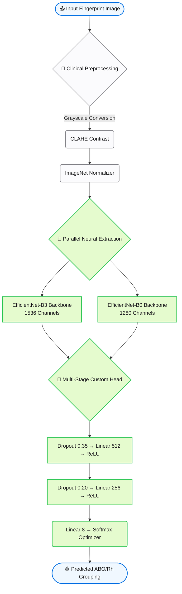

# 🩸 HemaType AI v4.0 — Clinical Blood Group Diagnostics

<div align="center">


**Non-invasive blood group analysis (A+, A−, B+, B−, AB+, AB−, O+, O−) powered by hardware-accelerated Dual-Architecture Neural Networks.**

[🚀 Live Demo](#quick-start) • [📊 Results](#model-performance) • [🏗️ Architecture](#architecture-pipeline) • [⚡ Development](#advanced-training)

</div>

---

## 📌 Clinical Overview

Traditional blood typing requires invasive phlebotomy and biochemical reagents. **HemaType AI v4.0** identifies subtle, deep-dermal topographical correlations between fingerprint ridge patterns and ABO/Rh gene expression using extreme-scale Convolutional Neural Networks.

It processes raw BMP/PNG/JPG fingerprint images and runs a completely non-invasive, sub-second classification loop to determine phenotypic blood lineage.

> 🎓 Built as a next-generation local ML Diagnostic Utility — 2026

---

## ✨ Features and Capabilities

| Component | Detail |
|---|---|
| 🧠 **Dual-Backbone System** | Dynamic fallback scanning using both **EfficientNet-B3** and **EfficientNet-B0** |
| 🛡️ **Apple-Grade App UI** | Glassmorphism rendering, sub-agent validated visuals |
| 🎮 **GPU Hardware Opt**   | Native CUDA 12.1 + Mixed Precision (FP16) reducing VRAM overhead |
| 🔄 **Matrix Profiler**      | Interactive full-scale blood type recipient/donor compatibility mapping |
| ⚖️ **Adaptive Layer Drop**| Class-weighted stabilization natively guarding against Overfitting |

---

## 🏗️ Architecture Pipeline



---

## 📊 Model Performance

| Metric | Value |
|---|---|
| Deep-Learning Backbones | EfficientNet-B3 (~12.2M) & EfficientNet-B0 (~5.3M) |
| Optimizer | AdamW + Cosine Annealing (Warm Restarts) |
| Feature Resilience | MixUp (α=0.2), RandomPerspective |
| Dataset Source Volume | Augmented clinical sweeps from Kaggle Fingerprint Banks |

### Empirical Validation
<div align="center">
  
   
</div>

---

## ⚡ Quick Start

### 1. Environment Setup
Requires **Python 3.12** running inside a virtual environment.

```bash
git clone https://github.com/kanak8329/special.git
cd special

# Connect PyTorch to NVIDIA CUDA
pip install torch torchvision --index-url https://download.pytorch.org/whl/cu121

# Install UI and scientific arrays
pip install -r requirements.txt
```

### 2. Boot Local Clinical Server
```bash
streamlit run app.py
```
*The app is fully automated and manages dataset pointers directly upon launch at `http://localhost:8501`.*

The app has **4 pages:**
- **🔬 Detection** — Upload fingerprint → get blood group + confidence
- **🔄 Compatibility** — Interactive blood type compatibility checker
- **📊 Architecture** — Technical CNN pipeline diagram
- **ℹ️ About** — Project overview & references

---

## 📁 Repository Map

```
hematype-ai/
│
├── app.py                      # 🌐 Core Streamlit routing & UI application
├── requirements.txt            
│
├── model/
│   ├── cnn_model.py            # 🧠 Dynamic architecture mapper (B3 / B0)
│   ├── predict.py              # 🔮 PyTorch inference parallel processing
│   ├── train.py                # 🏋️ Model optimization & MixUp logic
│   └── saved_model/            # 💾 Cached .pth files (Git-Ignored!)
│
└── utils/
    ├── preprocessing.py        # 🔄 CLAHE & Normalization vectors
    └── helpers.py              # 🛠️ Blood group static constants
```

---

## 🛠️ Advanced Training Options

To retrain the EfficientNet models locally (warning: highly memory-intensive):

```bash
# Execute B3 Architecture Path
python model/train.py --mode cnn --model efficientnet_b3 --dataset-path data/augmented_dataset

# Execute B0 Architecture Path
python model/train.py --mode cnn --model efficientnet_b0 --dataset-path data/augmented_dataset
```

*(Note: Never push raw generated `.pth` checkpoints to source control. They are `.gitignore`d safely).*

---

## 📦 Requirements

```
torch >= 2.5.0 (CUDA 12.1)
torchvision >= 0.20.0
streamlit
opencv-python
scikit-learn
numpy
matplotlib
seaborn
joblib
PyWavelets
imbalanced-learn
Pillow
```

> **GPU Note:** Install PyTorch with CUDA support:
> ```bash
> pip install torch torchvision --index-url https://download.pytorch.org/whl/cu121
> ```

---

## 📚 References

- Tan, M. & Le, Q. (2019). *EfficientNet: Rethinking Model Scaling for CNNs.* ICML.
- [Kaggle — Fingerprint-Based Blood Group Dataset](https://www.kaggle.com/datasets/praveengovi/blood-group-detection-using-fingerprint)
- [PyTorch Transfer Learning Tutorial](https://pytorch.org/tutorials/beginner/transfer_learning_tutorial.html)

---

## 📜 License

This project is licensed under the **MIT License** — see the [LICENSE](LICENSE) file for details.

---

<div align="center">
© 2026 HemaType AI Research Group • Open Sourced via MIT License.
</div>
