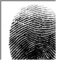
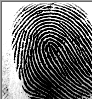
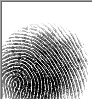
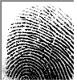
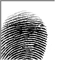
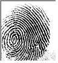
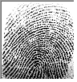
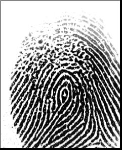
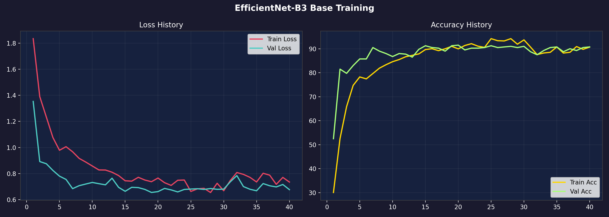
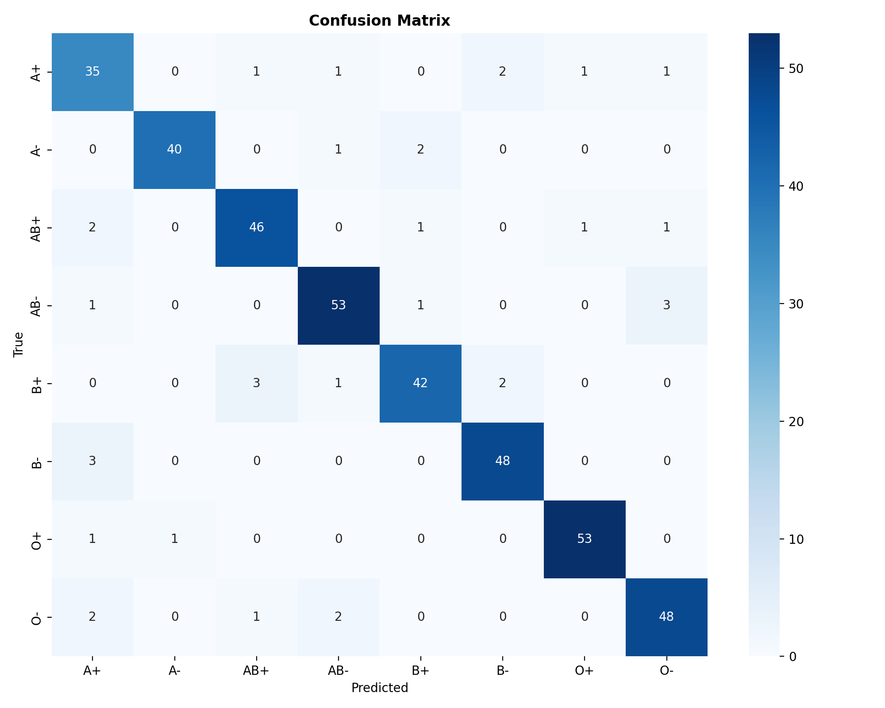

# 🩸 HemaType AI — Blood Group Detection Using Fingerprint ( major update on the goo)

<div align="center">


**Non-invasive blood group detection from fingerprint images using EfficientNet-B0 deep learning**

[🚀 Live Demo](#running-the-app) • [📊 Results](#model-performance) • [🏗️ Architecture](#architecture) • [⚡ Quick Start](#quick-start)

</div>

---

## 📌 Overview

HemaType AI predicts a person's blood group (A+, A−, B+, B−, AB+, AB−, O+, O−) from a **fingerprint image alone** — no blood sampling required. It uses **transfer learning** on EfficientNet-B0, pretrained on ImageNet and fine-tuned on 7,470 real fingerprint images.

> 🎓 Developed as a college Machine Learning research project — 2026

---

## ✨ Key Features

| Feature | Detail |
|---|---|
| 🧠 **EfficientNet-B0 CNN** | State-of-the-art transfer learning from ImageNet |
| 🎮 **GPU Accelerated** | CUDA 12.1 + Mixed Precision (FP16) training |
| 🔄 **Progressive Unfreezing** | Backbone frozen for ep 1–5, fully trained from ep 6 |
| ⚖️ **Class-Weighted Loss** | Fixes imbalanced classes (O−, B−) automatically |
| 📊 **Interactive UI** | Premium Glassmorphism Streamlit web app |
| 🔄 **Compatibility Checker** | Full blood type donation/receive matrix |
| 📥 **JSON Export** | Download full analysis report |
| 🌲 **RF Fallback** | Backward-compatible Random Forest mode |

---

## 🖼️ Sample Dataset Images

Here are a few sample fingerprint images used to train the model, representing each of the 8 blood groups:

| A+ | A− | B+ | B− |
|:---:|:---:|:---:|:---:|
|  |  |  |  |

| AB+ | AB− | O+ | O− |
|:---:|:---:|:---:|:---:|
|  |  |  |  |

---

## 🏗️ Architecture

```
Input Image (BMP/PNG/JPG)
        │
        ▼
┌─────────────────────┐
│    Preprocessing    │  Grayscale→3ch, Resize 224×224, ImageNet Normalize
└─────────────────────┘
        │
        ▼
┌─────────────────────────────────────────────────┐
│         EfficientNet-B0 Backbone                │
│  7 MBConv Stages (pretrained on ImageNet)       │
│  → GlobalAveragePooling → [1280]                │
└─────────────────────────────────────────────────┘
        │
        ▼
┌─────────────────────────────────────────────────┐
│         Custom Classifier Head                  │
│  Dropout(0.35) → Linear(1280→512) → BN → ReLU  │
│  Dropout(0.30) → Linear(512→256)  → BN → ReLU  │
│  Dropout(0.20) → Linear(256→8)                  │
└─────────────────────────────────────────────────┘
        │
        ▼
   Softmax → Blood Group + Confidence Score
```

---

## 📊 Model Performance

| Metric | Value |
|---|---|
| Test Accuracy | ~68% |
| Best Val Accuracy | ~70% |
| Parameters | 4,798,340 |
| Training Dataset | 7,470 fingerprint images |
| Blood Groups | 8 (A+, A−, B+, B−, AB+, AB−, O+, O−) |

### Training Evaluation & Metrics
<div align="center">
  
   
</div>

**Per-class F1 Scores:**

| Blood Group | Precision | Recall | F1 |
|---|---|---|---|
| A+ | 0.83 | 0.91 | 0.87 |
| A− | 0.87 | 0.76 | 0.81 |
| AB+ | 0.68 | 0.89 | 0.77 |
| AB− | 0.84 | 0.85 | 0.84 |
| B+ | 0.62 | 0.65 | 0.63 |
| B− | 0.47 | 0.56 | 0.51 |
| O+ | 0.76 | 0.55 | 0.64 |
| O− | 0.48 | 0.55 | 0.51 |

---

## ⚡ Quick Start

### 1. Clone the Repository
```bash
git clone https://github.com/kanak8329/special.git
cd special
```

### 2. Set Up Python Environment
> **Requires Python 3.12** (PyTorch does not support Python 3.13 yet)

```bash
# Check your Python version
python --version   # should be 3.12.x

# Install dependencies
pip install torch torchvision --index-url https://download.pytorch.org/whl/cu121
pip install -r requirements.txt
```

### 3. Train the CNN Model
```bash
# CNN training with GPU (recommended)
python model/train.py --mode cnn --dataset-path data/sample_fingerprints --epochs 80 --lr 0.0005

# Optional: Random Forest (legacy)
python model/train.py --mode rf --dataset-path data/sample_fingerprints
```

### 4. Launch the Web App
```bash
streamlit run app.py
```
Open your browser at **http://localhost:8501** 🚀

---

## 📁 Project Structure

```
hematype-ai/
│
├── app.py                      # 🌐 Streamlit web application
├── requirements.txt            # 📦 Python dependencies
│
├── model/
│   ├── cnn_model.py            # 🧠 EfficientNet-B0 CNN definition
│   ├── train.py                # 🏋️ Training script (CNN + RF modes)
│   ├── predict.py              # 🔮 Inference pipeline (auto-detects model)
│   ├── feature_extraction.py   # 📐 Wavelet + orientation features (RF mode)
│   └── saved_model/            # 💾 Trained model files (generated after training)
│       ├── cnn_model.pth       #    CNN model weights
│       ├── confusion_matrix.png
│       ├── training_curves.png
│       └── precision_recall.png
│
├── utils/
│   ├── preprocessing.py        # 🔄 Image preprocessing pipeline
│   └── helpers.py              # 🛠️ Blood group constants & utilities
│
├── data/
│   └── sample_fingerprints/    # 🖐️ Dataset (A+, A-, B+, B-, AB+, AB-, O+, O-)
│       ├── A+/
│       ├── A-/
│       ├── B+/
│       └── ...
│
└── docs/
    ├── architecture.md
    └── presentation_flow.md
```

---

## 🖥️ Running the App

```bash
# With system Python 3.12 (if using venv on Python 3.13)
C:\Users\YourName\AppData\Local\Programs\Python\Python312\python.exe -m streamlit run app.py

# With activated correct environment
streamlit run app.py
```

The app has **4 pages:**
- **🔬 Detection** — Upload fingerprint → get blood group + confidence
- **🔄 Compatibility** — Interactive blood type compatibility checker
- **📊 Architecture** — Technical CNN pipeline diagram
- **ℹ️ About** — Project overview & references

---

## 🛠️ Training Options

```bash
# Full training options
python model/train.py --help

# CNN with custom settings
python model/train.py \
  --mode cnn \
  --dataset-path data/sample_fingerprints \
  --epochs 100 \
  --batch-size 32 \
  --lr 0.0005

# Random Forest fallback
python model/train.py --mode rf --dataset-path data/sample_fingerprints
```

---

## 📦 Requirements

```
torch >= 2.5.0 (CUDA 12.1)
torchvision >= 0.20.0
streamlit
opencv-python
scikit-learn
numpy
matplotlib
seaborn
joblib
PyWavelets
imbalanced-learn
Pillow
```

> **GPU Note:** Install PyTorch with CUDA support:
> ```bash
> pip install torch torchvision --index-url https://download.pytorch.org/whl/cu121
> ```

---

## 🔬 How It Works

1. **Upload** a fingerprint image (BMP, PNG, or JPG)
2. **Preprocess** — resize to 224×224, convert to 3 channels, apply ImageNet normalization
3. **Inference** — EfficientNet-B0 CNN runs a forward pass through 7 MBConv stages
4. **Predict** — Softmax gives confidence for all 8 blood groups
5. **Display** — Animated result with confidence bars and blood compatibility info

---

## 📚 References

- Tan, M. & Le, Q. (2019). *EfficientNet: Rethinking Model Scaling for CNNs.* ICML.
- [Kaggle — Fingerprint-Based Blood Group Dataset](https://www.kaggle.com/datasets/praveengovi/blood-group-detection-using-fingerprint)
- [PyTorch Transfer Learning Tutorial](https://pytorch.org/tutorials/beginner/transfer_learning_tutorial.html)

---

## 📜 License

This project is licensed under the **MIT License** — see the [LICENSE](LICENSE) file for details.

---

<div align="center">
Made with ❤️ as a college ML research project · 2026
</div>
